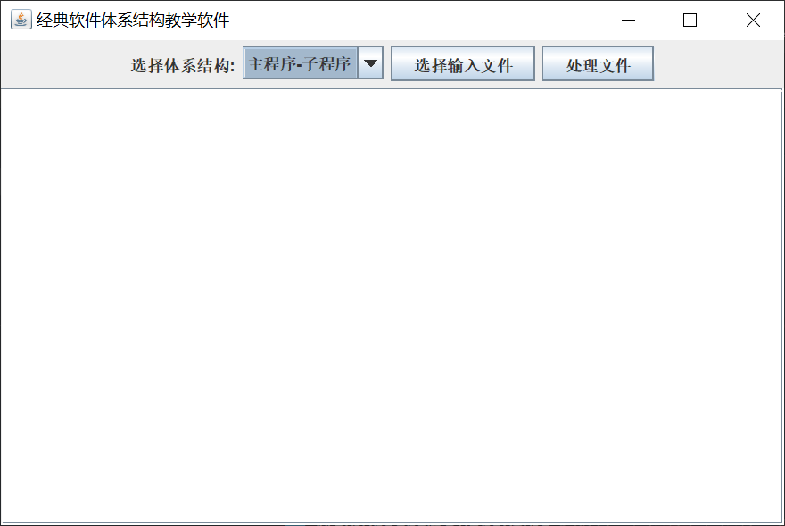
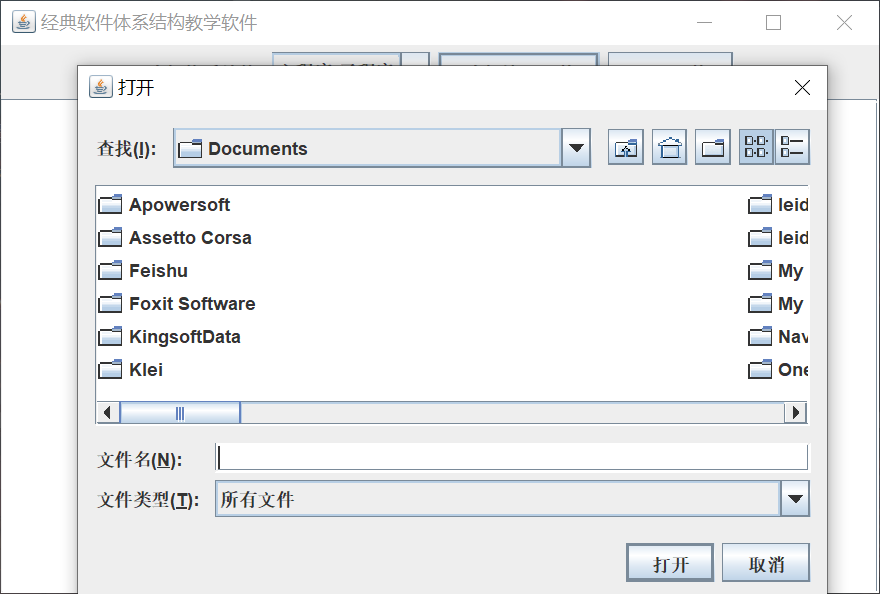
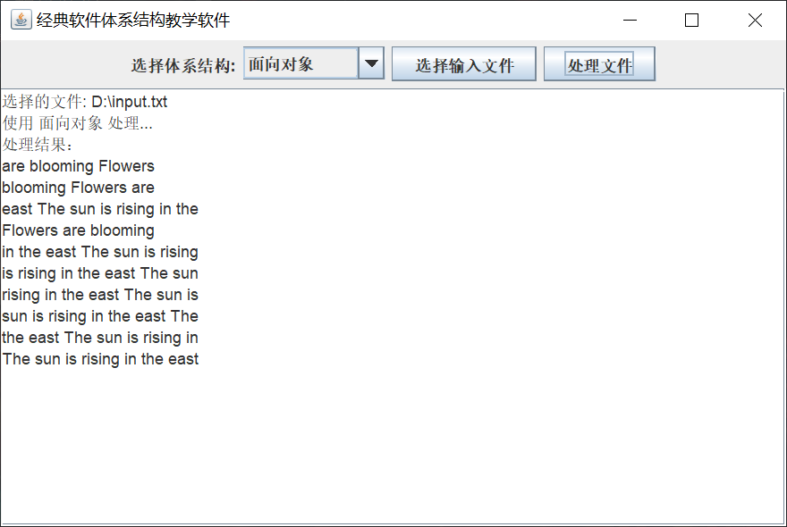
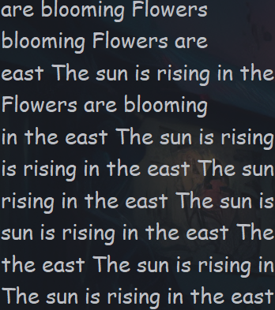

# 经典软件体系结构教学软件

本项目是一个用于展示经典软件体系结构风格的教学软件，支持四种软件体系结构风格的处理方式：主程序-子程序、面向对象、事件系统、管道-过滤器。用户可以通过图形界面选择不同的体系结构处理指定的输入文件，并查看处理结果。

## 功能

- 支持通过图形界面选择四种软件体系结构风格之一
- 支持选择输入文件并根据所选体系结构进行处理
- 处理结果以 KWIC（Key Word In Context）系统为例，展示输入文件的各行循环移位后，按字母顺序排序的结果
- 能够查看处理结果在界面上显示

## 体系结构风格介绍

1. **主程序-子程序**
    - 使用主程序调用多个子程序完成任务。
    - 代码模块化，核心逻辑被分成不同的子程序。

2. **面向对象**
    - 基于对象和类的封装、继承和多态，使用类之间的协作完成任务。
    - 代码更具可扩展性和灵活性，封装性强。

3. **事件系统**
    - 基于事件的发布和订阅机制，处理事件流。
    - 使用监听器和事件管理器来协调不同的模块。

4. **管道-过滤器**
    - 将任务分为多个步骤，每个步骤是一个过滤器，数据通过管道传输。
    - 适合处理流水线数据，具有良好的模块化和数据处理能力。

## 如何使用

### 前提条件

- **Java 8** 或更高版本
- 任意文本编辑器或 IDE（如 IntelliJ IDEA 或 Eclipse）

### 编译与运行

1. 下载或克隆本项目到本地：

   ```bash
   git clone https://github.com/your-repo/classic-software-architecture-teaching-software.git
   cd classic-software-architecture-teaching-software
   ```

2. 使用 Java 编译器编译项目：

   ```bash
   javac -d bin src/*.java
   ```

3. 运行主程序：

   ```bash
   java -cp bin SoftwareArchitectureTeachingApp
   ```

### 使用步骤

1. 启动软件后，选择**输入文件**，选择文本文件作为处理的输入。

2. 从**下拉菜单**中选择四种体系结构风格之一：`主程序-子程序`、`面向对象`、`事件系统`、`管道-过滤器`。

3. 点击**处理文件**按钮，结果将在界面中显示。

4. 处理的文本将展示为 KWIC 系统的排序结果，每一行的循环移位情况按照字母顺序输出。

### 输入文件格式

输入文件是包含若干行文本的普通文本文件。每一行会被作为一个独立的条目进行循环移位处理。

**示例输入文件：**

```
The sun is rising in the east
Flowers are blooming
```

**示例输出结果：**

```
are blooming Flowers 
blooming Flowers are
east the sun is rising in the
Flowers are blooming
in the east the sun is rising
is rising in the east the sun
rising in the east the sun is
sun is rising in the east the
the east the sun is rising in
The sun is rising in the east
```

## 项目结构

```
.
├── src
│   ├── event  # 事件系统架构
│       ├── EventListener.java  # 事件侦听器
│       ├── EventSystem.java  # kwic 事务系统(事件系统实现)
│       ├── KWICEventManager.java  # kwic 事务管理器
│       ├── KWICPrinter.java  # Kwic 打印机
│       ├── KWICShiftGenerator.java  # Kwic 交换机
│       ├── KWICSorter.java  # Kwic 排序器
│   ├── main_program_and_subroutine            # 主程序-子程序架构
│       ├── MainProgramSubroutine.java                   # 主程序-子程序实现
│   ├── object_oriented                     # 面向对象架构
│       ├── KWICSystem.java                     # KWIC 系统
│       ├── ObjectOriented.java                     # 面向对象实现
│   ├── PipelineFilter                   # 管道-过滤器架构
│       ├── Filter.java                   # 管道-过滤器实现
│       ├── KWICPipelineSystem.java                   # KWIC 管道过滤系统
│       ├── PipelineFilter.java                   # 管道-过滤器实现
│       ├── ShiftFilter.java                   # 交换过滤器
│       ├── SortFilter.java                   # 排序过滤器实现
│   ├── SoftwareArchitectureTeachingApp.java  # 主程序，包含 GUI 界面
├── README.md                                 # 项目说明文件

```

## 体系结构示例与代码解释

1. **主程序-子程序**
    - 代码通过调用多个子程序函数来完成整个 KWIC 系统的处理，包括读取文件、生成移位和排序。

2. **面向对象**
    - 使用类和对象的封装特性实现 KWIC 系统。`KWICSystem` 类负责生成移位和排序，代码具有较强的可扩展性。

3. **事件系统**
    - 基于事件驱动模型，发布者发布事件后，订阅者（移位生成器和排序器）处理事件，并输出结果。

4. **管道-过滤器**
    - 数据从输入过滤器经过移位过滤器，最终经过排序过滤器。每个过滤器在流水线上处理数据。


## 软件界面

### 启动界面
默认选择的是(主程序-子程序架构)


### 选择文件界面

默认打开的是系统的 Document 文件夹


### 处理文件界面
处理完成之后，结果会在框中显示

同时处理结果也会在控制台中打印输出


本软件(demo)的介绍就到此结束~